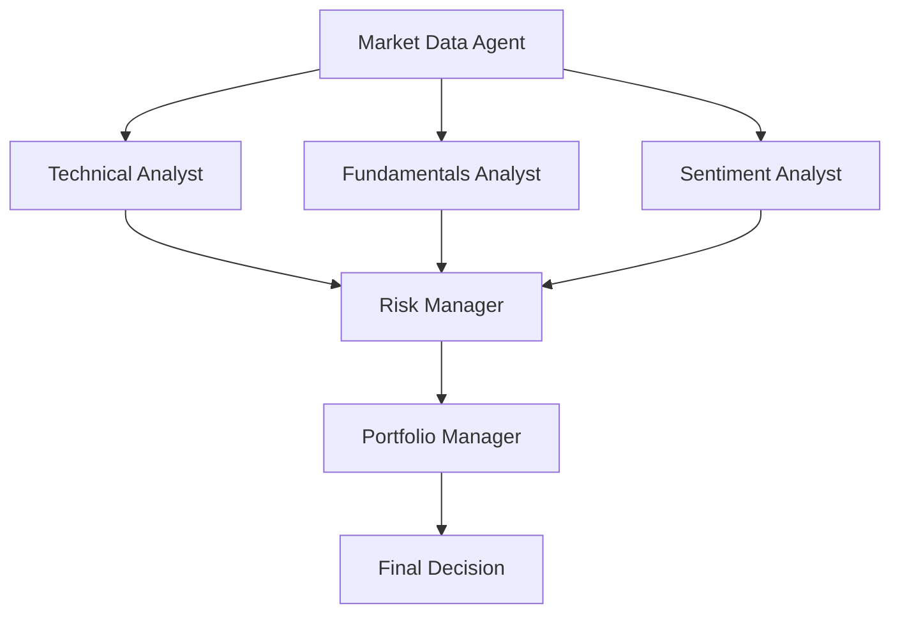

# Free US Investment Agent System 🚀

A sophisticated AI-powered investment agent system for US stock market analysis and trading decisions, leveraging yfinance for market data and AlphaVantage for news sentiment analysis.

🌏 English | [简体中文](README_zh.md)

## 🛡️ Disclaimer

This project is for **educational and research purposes only**.

- Not intended for real trading or investment
- No warranties or guarantees provided
- Past performance does not indicate future results
- Creator assumes no liability for financial losses
- Consult a financial advisor for investment decisions

By using this software, you agree to use it solely for learning purposes.

## ✨ Features

- Real-time US stock market data analysis using yfinance
- News sentiment analysis through AlphaVantage API
- AI-powered trading decision making
- Comprehensive backtesting capabilities
- Detailed reasoning for investment decisions
- Support for multiple trading strategies

## 🏗️ System Architecture

The system employs multiple AI agents working together to make investment decisions:



### Agent Descriptions

1. **Market Data Agent**

   - Gathers historical price data from yfinance
   - Collects financial metrics and statements
   - Preprocesses data for other agents

2. **Technical Analyst**

   - Analyzes price trends and patterns
   - Calculates technical indicators
   - Generates technical trading signals

3. **Fundamentals Analyst**

   - Evaluates company financial health
   - Analyzes growth metrics
   - Provides fundamental analysis signals

4. **Sentiment Analyst**

   - Fetches news from AlphaVantage
   - Analyzes news sentiment using Gemini
   - Generates sentiment-based signals

5. **Risk Manager**

   - Integrates signals from all analysts
   - Evaluates potential risks
   - Sets position limits
   - Provides risk-adjusted recommendations

6. **Portfolio Manager**
   - Makes final trading decisions
   - Manages position sizing
   - Balances risk and reward
   - Generates executable orders

### Workflow

1. Market Data Agent collects all necessary data
2. Three analysts (Technical, Fundamental, Sentiment) work in parallel
3. Risk Manager combines and evaluates all signals
4. Portfolio Manager makes the final decision

## 📁 Project Structure

```
Free_US_Investment_Agent_System/
├── src/                    # Source code
│   ├── agents/            # AI agents implementation
│   ├── tools/             # Utility tools
│   ├── utils/             # Helper functions
│   ├── data/              # Data storage
│   ├── img/               # Image resources
│   ├── backtester.py      # Backtesting implementation
│   ├── main.py            # Main application entry
│   └── test_*.py          # Test files
├── logs/                  # Application logs
├── .env.example          # Environment variables template
├── pyproject.toml        # Poetry dependency management
├── poetry.lock          # Poetry lock file
└── LICENSE              # MIT License
```

### Logs and Data

The system generates two types of logs:

- `api_calls_[date].log`: Records all API calls and their responses
- `backtest_[ticker]_[date]_[start]_[end].log`: Records backtesting results and analysis

The system stores data in JSON format:

- News data: `src/data/stock_news/[ticker]/[date]_news.json` (Note: The date in filename represents the day before the analysis date, as we use historical news to make current day's decisions)

```json
{
  "date": "2024-12-10",
  "news": [
    {
      "title": "Tesla Stock Surges Post-Trump Win",
      "content": "Musk-Trump ties and autonomous driving growth...",
      "publish_time": "2024-12-10 20:05:00",
      "source": "Zacks Commentary",
      "url": "https://www.zacks.com/..."
    }
  ]
}
```

- Sentiment cache: `src/data/sentiment_cache.json`

```json
{
  "2024-12-09": 0.1, // Sentiment score: -1 (very negative) to 1 (very positive)
  "2024-12-10": 0.6
}
```

## 📋 Prerequisites

- Python 3.11
- Poetry for dependency management
- AlphaVantage API key (Get your free API key from [AlphaVantage](https://www.alphavantage.co/support/#api-key))
  - Note: Free API key has a limit of 25 requests per day for news data
- Gemini API key (Get your free API key from [Google AI Studio](https://aistudio.google.com/))

## ⚠️ Important Notes

The investment strategy implemented in this system is for educational purposes only. Users are encouraged to:

- Develop and implement their own trading strategies
- Customize the analysis parameters
- Modify the decision-making logic
- Test thoroughly before any real trading

## 🔧 Installation

1. Install Poetry:

### Windows (PowerShell)

```powershell
(Invoke-WebRequest -Uri https://install.python-poetry.org -UseBasicParsing).Content | py -
```

### Unix/macOS

```bash
curl -sSL https://install.python-poetry.org | python3 -
```

2. Clone the repository:

```bash
git clone https://github.com/24mlight/Free_US_Investment_Agent_System.git
cd Free_US_Investment_Agent_System
```

3. Install dependencies:

```bash
poetry install
```

4. Set up your environment variables:

You can set up your environment variables in two ways:

a) **Directly edit the .env file** (Recommended):

```bash
cp .env.example .env
```

Then edit the .env file:

```
ALPHA_VANTAGE_API_KEY=your_api_key_here
GEMINI_API_KEY=your_gemini_api_key_here
GEMINI_MODEL=gemini-1.5-flash
```

b) **Via command line**:

Unix/macOS:

```bash
export ALPHA_VANTAGE_API_KEY='your_api_key_here'
export GEMINI_API_KEY='your_gemini_api_key_here'
export GEMINI_MODEL='gemini-1.5-flash'
```

Windows PowerShell:

```powershell
$env:ALPHA_VANTAGE_API_KEY='your_api_key_here'
$env:GEMINI_API_KEY='your_gemini_api_key_here'
$env:GEMINI_MODEL='gemini-1.5-flash'
```

## 🚀 Usage

### Real-time Analysis

The system predicts trading decisions for the next trading day based on current market data and historical news:

1. **Basic Usage**

```bash
poetry run python src/main.py --ticker TSLA
```

2. **Show Detailed Analysis**

```bash
poetry run python src/main.py --ticker TSLA --show-reasoning
```

3. **Custom Date and News Analysis**

```bash
poetry run python src/main.py --ticker TSLA --show-reasoning --end-date 2024-12-13 --num-of-news 5
```

Parameters:

- `--ticker`: Stock symbol (e.g., TSLA for Tesla)
- `--show-reasoning`: Display AI reasoning for decisions
- `--end-date`: The date for which to predict next day's trading decision (YYYY-MM-DD format)
- `--num-of-news`: Number of historical news articles to analyze (default: 5, max: 100)
- `--initial-capital`: Initial cash amount (optional, default: 100,000)

### Backtesting

To run backtesting analysis:

```bash
poetry run python src/backtester.py --ticker TSLA --start-date 2024-12-10 --end-date 2024-12-17 --num-of-news 5
```

Parameters:

- `--ticker`: Stock symbol
- `--start-date`: Backtesting start date (YYYY-MM-DD format)
- `--end-date`: Backtesting end date (YYYY-MM-DD format)
- `--num-of-news`: Number of news articles to analyze (default: 5, max: 100)
- `--initial-capital`: Initial cash amount (optional, default: 100,000)

### Output Description

The system will output:

1. Fundamental analysis results
2. Technical analysis results
3. Sentiment analysis results
4. Risk management assessment
5. Final trading decision

When using `--show-reasoning`, you'll see detailed analysis from each agent.

Example Output:

```json
{
  "action": "buy",
  "quantity": 100,
  "confidence": 0.75,
  "agent_signals": [
    {
      "agent": "Technical Analysis",
      "signal": "bullish",
      "confidence": 0.8
    },
    {
      "agent": "Sentiment Analysis",
      "signal": "neutral",
      "confidence": 0.6
    }
  ],
  "reasoning": "Technical indicators show strong upward momentum..."
}
```

## 📊 Results

Here's an example of our backtesting results:


## 📄 License

This project is licensed under the MIT License.

## 🙏 Acknowledgments

This project is modified from [ai-hedge-fund](https://github.com/virattt/ai-hedge-fund.git). We sincerely thank the original authors for their excellent work and inspiration.

Additional acknowledgments:

- [yfinance](https://github.com/ranaroussi/yfinance) for market data
- [AlphaVantage](https://www.alphavantage.co/) for news and sentiment analysis

## ☕ Support the Project

If you find this project helpful, consider buying me a coffee!


