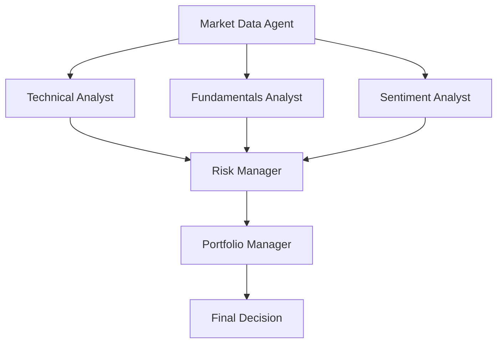
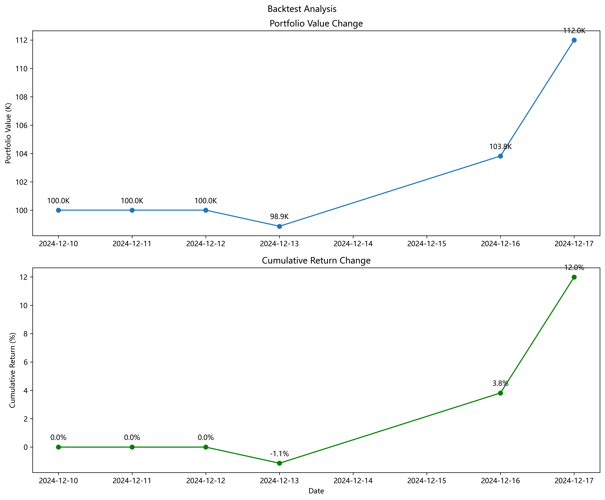

# 美股投资代理系统 🚀

一个基于人工智能的美股市场分析和交易决策系统，使用 yfinance 获取市场数据，通过 AlphaVantage 进行新闻情感分析。

🌏 [English](README.md) | 简体中文

## 🛡️ 免责声明

本项目仅用于**教育和研究目的**。

- 不适用于实际交易或投资
- 不提供任何保证
- 过往业绩不代表未来表现
- 创建者不承担任何财务损失责任
- 投资决策请咨询专业理财顾问

使用本软件即表示您同意仅将其用于学习目的。

## ✨ 功能特点

- 使用 yfinance 进行实时美股市场数据分析
- 通过 AlphaVantage API 进行新闻情感分析
- AI-powered 交易决策
- 全面的 backtesting 功能
- 详细的决策推理过程
- 支持多种交易策略

## 🏗️ 系统架构

系统由多个 AI Agent 协同工作来制定投资决策：



### Agent 说明

1. **Market Data Agent**

   - 从 yfinance 获取历史价格数据
   - 收集财务指标和报表
   - 为其他 Agent 预处理数据

2. **Technical Analyst**

   - 分析价格趋势和模式
   - 计算技术指标
   - 生成技术交易信号

3. **Fundamentals Analyst**

   - 评估公司财务健康状况
   - 分析增长指标
   - 提供基本面分析信号

4. **Sentiment Analyst**

   - 从 AlphaVantage 获取新闻
   - 使用 Gemini 分析新闻情感
   - 生成基于情感的信号

5. **Risk Manager**

   - 整合所有分析师的信号
   - 评估潜在风险
   - 设置仓位限制
   - 提供风险调整后的建议

6. **Portfolio Manager**
   - 制定最终交易决策
   - 管理仓位大小
   - 平衡风险和收益
   - 生成可执行订单

### 工作流程

1. Market Data Agent 收集所有必要数据
2. 三位 Analyst（Technical、Fundamental、Sentiment）并行工作
3. Risk Manager 综合评估所有信号
4. Portfolio Manager 做出最终决策

## 📁 项目结构

```
Free_US_Investment_Agent_System/
├── src/                    # Source code
│   ├── agents/            # AI agents implementation
│   ├── tools/             # Utility tools
│   ├── utils/             # Helper functions
│   ├── data/              # Data storage
│   ├── img/               # Image resources
│   ├── backtester.py      # Backtesting implementation
│   ├── main.py            # Main application entry
│   └── test_*.py          # Test files
├── logs/                  # Application logs
├── .env.example          # Environment variables template
├── pyproject.toml        # Poetry dependency management
├── poetry.lock          # Poetry lock file
└── LICENSE              # MIT License
```

### 日志和数据

系统生成两类日志：

- `api_calls_[date].log`: 记录所有 API 调用及其响应
- `backtest_[ticker]_[date]_[start]_[end].log`: 记录回测结果和分析

系统以 JSON 格式存储数据：

- 新闻数据：`src/data/stock_news/[ticker]/[date]_news.json`（注意：文件名中的日期表示分析日期的前一天，因为我们使用历史新闻来做当天的决策）

```json
{
  "date": "2024-12-10",
  "news": [
    {
      "title": "特斯拉股价在特朗普胜选后上涨",
      "content": "马斯克-特朗普关系和自动驾驶增长...",
      "publish_time": "2024-12-10 20:05:00",
      "source": "Zacks Commentary",
      "url": "https://www.zacks.com/..."
    }
  ]
}
```

- 情感缓存：`src/data/sentiment_cache.json`

```json
{
  "2024-12-09": 0.1, // 情感得分：-1（极其消极）到1（极其积极）
  "2024-12-10": 0.6
}
```

## 📋 环境要求

- Python 3.11
- Poetry 依赖管理工具
- AlphaVantage API 密钥（从[AlphaVantage](https://www.alphavantage.co/support/#api-key)获取免费密钥）
  - 注意：免费 API 密钥每天限制 25 次新闻数据请求
- Gemini API 密钥（从[Google AI Studio](https://aistudio.google.com/)获取免费密钥）

## ⚠️ 重要说明

本系统实现的投资策略仅用于教育目的。我们鼓励用户：

- 开发和实现自己的交易策略
- 自定义分析参数
- 修改决策逻辑
- 在实际交易前进行充分测试

## 🔧 安装

1. 安装 Poetry：

### Windows (PowerShell)

```powershell
(Invoke-WebRequest -Uri https://install.python-poetry.org -UseBasicParsing).Content | py -
```

### Unix/macOS

```bash
curl -sSL https://install.python-poetry.org | python3 -
```

2. 克隆仓库：

```bash
git clone https://github.com/24mlight/Free_US_Investment_Agent_System.git
cd Free_US_Investment_Agent_System
```

3. 安装依赖：

```bash
poetry install
```

4. 设置环境变量：

您可以通过两种方式设置环境变量：

a) **直接编辑.env 文件**（推荐）：

```bash
cp .env.example .env
```

然后编辑.env 文件：

```
ALPHA_VANTAGE_API_KEY=你的api密钥
GEMINI_API_KEY=你的gemini密钥
GEMINI_MODEL=gemini-1.5-flash
```

b) **通过命令行**：

Unix/macOS:

```bash
export ALPHA_VANTAGE_API_KEY='你的api密钥'
export GEMINI_API_KEY='你的gemini密钥'
export GEMINI_MODEL='gemini-1.5-flash'
```

Windows PowerShell:

```powershell
$env:ALPHA_VANTAGE_API_KEY='你的api密钥'
$env:GEMINI_API_KEY='你的gemini密钥'
$env:GEMINI_MODEL='gemini-1.5-flash'
```

## 🚀 使用方法

### 实时分析

系统基于当前市场数据和历史新闻来预测下一个交易日的交易决策：

1. **基本用法**

```bash
poetry run python src/main.py --ticker TSLA
```

2. **显示详细分析**

```bash
poetry run python src/main.py --ticker TSLA --show-reasoning
```

3. **自定义日期和新闻分析**

```bash
poetry run python src/main.py --ticker TSLA --show-reasoning --end-date 2024-12-13 --num-of-news 5
```

参数说明：

- `--ticker`: 股票代码（如特斯拉的 TSLA）
- `--show-reasoning`: 显示 AI 决策推理过程
- `--end-date`: 需要预测下一个交易日决策的日期（YYYY-MM-DD 格式）
- `--num-of-news`: 用于分析的历史新闻数量（默认：5，最大：100）
- `--initial-capital`: 初始资金（可选，默认：100,000）

### 回测

运行回测分析：

```bash
poetry run python src/backtester.py --ticker TSLA --start-date 2024-12-10 --end-date 2024-12-17 --num-of-news 5
```

参数说明：

- `--ticker`: 股票代码
- `--start-date`: 回测开始日期（YYYY-MM-DD 格式）
- `--end-date`: 回测结束日期（YYYY-MM-DD 格式）
- `--num-of-news`: 分析的新闻数量（默认：5，最大：100）
- `--initial-capital`: 初始资金（可选，默认：100,000）

### 输出说明

系统将输出：

1. 基本面分析结果
2. 技术分析结果
3. 情感分析结果
4. 风险管理评估
5. 最终交易决策

使用`--show-reasoning`时，您将看到每个代理的详细分析。

示例输出：

```json
{
  "action": "buy",
  "quantity": 100,
  "confidence": 0.75,
  "agent_signals": [
    {
      "agent": "Technical Analysis",
      "signal": "bullish",
      "confidence": 0.8
    },
    {
      "agent": "Sentiment Analysis",
      "signal": "neutral",
      "confidence": 0.6
    }
  ],
  "reasoning": "技术指标显示强劲上涨动能..."
}
```

## 📊 结果展示

以下是回测结果示例：



## 📋 许可证

本项目采用 MIT 许可。

## 🙏 致谢

本项目修改自[ai-hedge-fund](https://github.com/virattt/ai-hedge-fund.git)。我们衷心感谢原作者的出色工作和启发。

特别感谢：

- [yfinance](https://github.com/ranaroussi/yfinance)提供市场数据
- [AlphaVantage](https://www.alphavantage.co/)提供新闻和情感分析支持

## ☕ 支持项目

如果您觉得这个项目对您有帮助，欢迎请作者喝杯咖啡！


